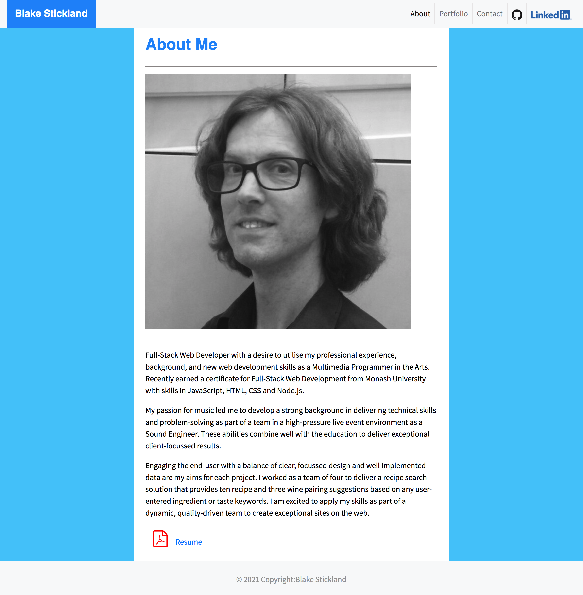

## Portfolio of Blake Stickland

A portfolio using responsive design to render on all devices, windows and screen sizes, great and small.

Link to deployed portfolio: https://blakestickland.github.io/portfolio/

## AIM:

Full-Stack Web Developer with a desire to utilise my professional experience, background, and new web development skills as a Multimedia Programmer in the Arts. Recently earned a certificate for Full-Stack Web Development from Monash University with skills in JavaScript, HTML, CSS and Node.js.

## GOALS:

Engaging the end-user with a balance of clear, focussed design and well implemented data are my aims for each project. I worked as a team of four to deliver a recipe search solution that provides ten recipe and three wine pairing suggestions based on any user-entered ingredient or taste keywords. I am excited to apply my skills as part of a dynamic, quality-driven team to create exceptional sites on the web.

